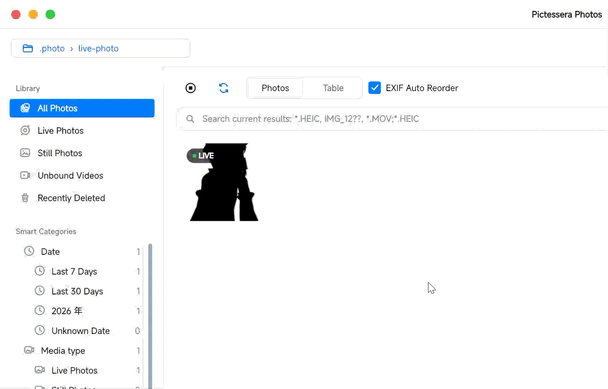
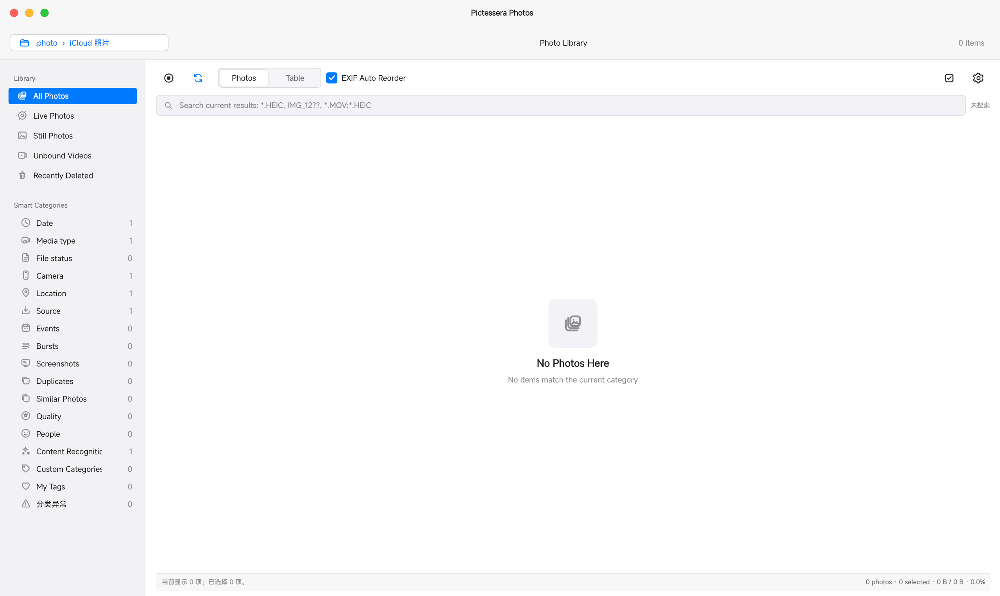
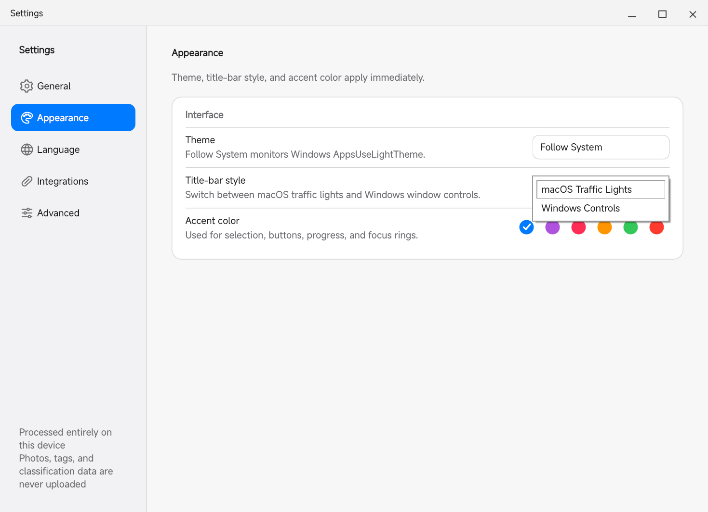
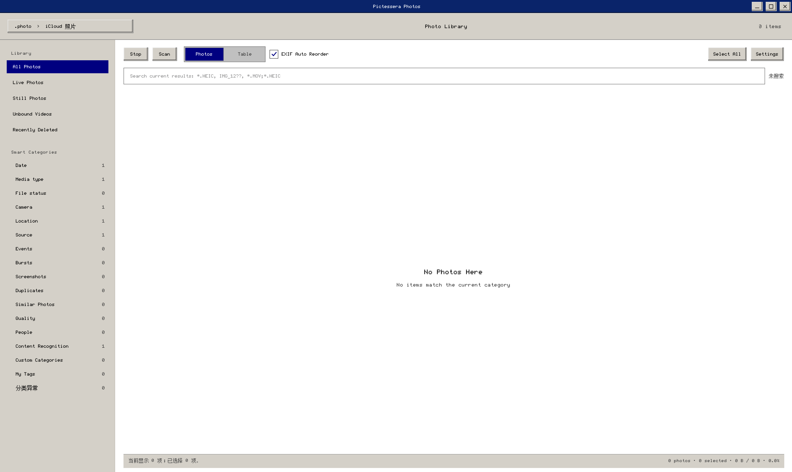
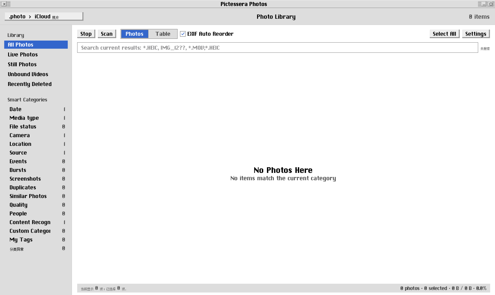

# Pictessera

<p align="center">
  <strong>English</strong> | <a href="README.zh-CN.md">简体中文</a>
</p>

<p align="center">
  
</p>

<p align="center">
  A local photo and Live Photo manager for Windows
</p>

Pictessera is designed for browsing and organizing iCloud photos that have already been downloaded to a local Windows folder. It scans photo libraries, pairs HEIC/JPEG/PNG images with their corresponding MOV files, and provides a virtualized photo wall, table view, detail preview, search, smart categories, and batch file operations.

Photos, EXIF metadata, GPS coordinates, classification results, and user data are processed locally by default. Pictessera does not sign in to or synchronize with iCloud, and it does not automatically upload photos.


## Features

- Recursively scan local photo folders, with stop and rescan support.
- Browse HEIC, HEIF, JPEG, JPG, and PNG images.
- Pair images and MOV files by directory and filename stem.
- Detect unpaired MOV files and bind or relocate them manually.
- Handle large libraries through virtualized grid and table views.
- Generate thumbnails and read EXIF/HEIF metadata in background workers.
- Sort by capture time, falling back to file modification time when necessary.
- Open multiple non-modal detail windows with zoom, pan, rotation, and navigation.
- Preview Live Photos on hover and use two-stage fast/HQ playback in detail views.
- Search with plain text, wildcards, AND/OR expressions, exclusions, and tags.
- Select individual items, ranges, or all visible items and inspect selection totals.
- Export normally or create iOS/DCF-style `IMG_####` export layouts.
- Use an application trash, restore items, and undo or redo supported actions.
- Choose light, dark, Windows, and classic Mac-inspired themes.
- Use Simplified Chinese, Traditional Chinese, or English UI text.

## Live Photo Preview

Pictessera recognizes the still image and MOV component as one Live Photo. Hover an item to start a quiet preview, or open it in the detail window for fast-first, high-quality playback when a suitable decoder is available.

<p align="center">
  
</p>

## Smart Categories

Categories are virtual views. Pictessera does not move, copy, or rename source files merely to classify them. A photo can belong to multiple categories, and the image and MOV components of a Live Photo remain one logical item.

| Category | Included views |
| --- | --- |
| Time | Year, year/month, last 7 days, last 30 days, unknown time |
| Media | Live Photo, still photo, HEIC/HEIF, JPEG, PNG, unpaired MOV |
| Source | Top-level library folder and actual source folder |
| Device | Camera manufacturer, camera model, unknown device |
| Location | Has GPS, no GPS, coarse coordinate region |
| File | Small image, large image, large file, missing metadata |
| Plus | Events, bursts, screenshots, duplicates, similar images, blur, content labels, favorites, ratings, and manual tags |

Classification is updated incrementally using stable file identities, source signatures, and rule versions. Unchanged items can reuse cached results.

## Search Syntax

Search operates within the current category or library filter.

```text
IMG_1234              Plain substring search
*.HEIC                Explorer-style wildcard
IMG_12??              Single-character wildcards
*.MOV;*.HEIC          OR expression; | is also supported
travel Shanghai       AND expression
travel -screenshot    Exclusion
tag:landscape         Tag search
```

Searchable data includes filenames, paths, extensions, media types, capture times, time sources, events, content labels, manual tags, favorites, and ratings.

## Requirements

- Windows 10 or Windows 11.
- Python 3.9. The source tree is currently verified with Python 3.9.18.
- A dedicated Conda or `venv` environment is recommended.
- Live Photo animation requires ffmpeg or the additional decoders bundled by the Plus edition.

## Fonts and Classic Themes

The modern themes use fonts already installed with Windows; no additional font is required for the System, Light, Dark, Windows 11, or Windows 7 themes.

The Windows 2000 and Mac OS 8 themes can use optional bitmap-style fonts for their intended appearance:

- **PoxiaoPixel** is the recommended Chinese pixel font for both classic themes, including Simplified and Traditional Chinese. Its family name is `PoxiaoPixel`; **XiaoyaPixel is not a substitute**.
- Windows 2000 also uses PoxiaoPixel's Latin glyphs for English. Mac OS 8 gives English Latin text priority to a licensed Chicago-compatible font, then falls back to PoxiaoPixel.
- Install fonts normally for Windows, or place legally obtained `.tt`, `.ttf`, `.otf`, or `.ttc` files in `Pictessera_Data/fonts/` beside the program. Source builds may alternatively use `assets/fonts/`.
- If an optional face is unavailable, Pictessera falls back to installed Windows CJK and UI fonts, so the program remains usable but the retro look will be less exact.

Original Chicago, Charcoal, Geneva, and other proprietary classic system fonts are **not bundled or redistributed** by Pictessera. Please obtain and use them only under the applicable font licence.

PoxiaoPixel is available from the [Poxiao Fonts repository](https://forge.poxiao-labs.work/Fonts/fzg). Check that repository's current licence and release notes before downloading or redistributing font files.

## Run from Source

From the project root:

```powershell
python -m pip install -r requirements.txt
python main.py
```

## Interface Gallery

The default interface is a compact Windows photo library with a sidebar, photo-wall/table switcher, current-filter search, and smart categories.

<p align="center">
  
</p>

<details>
<summary><strong>Window controls and settings</strong></summary>

Pictessera can use Windows controls or a macOS-inspired traffic-light title bar. Appearance settings switch the theme, title-bar controls, and accent color without a restart.

<p align="center">
  
</p>
<p align="center">
  
</p>
</details>

<details>
<summary><strong>Classic themes</strong></summary>

Windows 2000 and Mac OS 8 are optional visual themes. They keep the same photo-library features while using their own title bars, controls, palette, and optional pixel-font rules.

<p align="center">
  
</p>
<p align="center">
  
</p>
</details>

Core dependencies:

- PySide6 for the Windows desktop interface.
- Pillow for image decoding, resizing, and EXIF handling.
- pillow-heif for HEIC/HEIF decoding.
- PyInstaller for single-file Windows builds.

If the Windows `python` command resolves to the Microsoft Store launcher, activate the intended Conda/venv environment or invoke its `python.exe` directly.

## Editions and Packaging

### Lightweight Edition

The lightweight edition retains scanning, HEIC/JPEG/PNG browsing, metadata, search, classification, file management, and Live Photo pairing. It intentionally excludes OpenCV, NumPy, ImageIO, PyTorch, and Transformers.

```powershell
python -m PyInstaller --clean --noconfirm .\Pictessera.spec
```

Output:

```text
dist/Pictessera.exe
```

Without a system ffmpeg executable, still-image browsing and Live Photo file management remain available, but animated previews may be unavailable.

### Plus Edition

The Plus edition can bundle ffmpeg, OpenCV, NumPy, and ImageIO for a more complete iPhone HEVC MOV decoding fallback chain. Install the optional media dependencies before building:

```powershell
python -m pip install numpy==1.24.3 opencv-python==4.9.0.80 imageio==2.19.3 imageio-ffmpeg==0.6.0
python -m PyInstaller --clean --noconfirm .\PictesseraPlus.spec
```

Output:

```text
dist/Pictessera-Plus.exe
```

Local AI content recognition may additionally use `torch`, `transformers`, and `huggingface-hub`. The lightweight edition does not force model downloads or bundle external model directories.

## Data and Cache

Pictessera creates `Pictessera_Data/` beside the program by default:

```text
Pictessera_Data/
├── settings.json
├── trash_state.json
├── trash_journal.jsonl
├── item_info_cache.json
├── mov_bindings.json
├── auto_categories.json
├── item_category_relations.json
├── photo_manager.db
└── thumbs/
```

- `settings.json` stores user settings.
- `item_info_cache.json` caches capture time, camera, GPS, and dimensions.
- `mov_bindings.json` stores manual MOV bindings.
- `trash_state.json` and `trash_journal.jsonl` store application-trash state.
- `photo_manager.db` stores user labels, ratings, image features, and large classification snapshots.
- `thumbs/` contains generated thumbnail files.

JSON state generally uses temporary files, disk synchronization, atomic replacement, and `.bak` backups. Damaged files are quarantined so state can be restored or regenerated.

> Pictessera performs real copy and move operations. Keep an independent backup of important libraries and become familiar with move, trash, and export behavior using a small test folder first.

## Shortcuts

| Action | Shortcut or interaction |
| --- | --- |
| Undo | `Ctrl+Z` |
| Redo | `Ctrl+Shift+Z` |
| Previous/next detail item | `Left` / `Right`, or `A` / `D` |
| Next item or playback | `Space` |
| Fit detail view | `F` / `Enter` |
| Rotate preview left | `Ctrl+L` |
| Rotate preview right | `Ctrl+R` |
| Close detail view | `Esc` |
| Zoom detail view | Mouse wheel |
| Pan detail view | Drag with the left mouse button |

Preview rotation only changes the current display and does not modify the original photo.

## Project Structure

```text
.
├── main.py                         # Compatibility entry point and current main UI
├── photo_manager/
│   ├── bootstrap.py                # Qt and PyInstaller startup environment
│   ├── config.py                   # Shared policy and default parameters
│   ├── domain/                     # Photo, category, and metadata models
│   ├── services/                   # Classification, search, settings, analysis
│   ├── infrastructure/             # SQLite, repositories, and executors
│   └── ui/                         # Settings dialog and themes
├── assets/                         # Icons, SVG resources, and screenshots
├── tests/                          # Fast unit tests
├── Pictessera.spec                 # Lightweight PyInstaller build
└── PictesseraPlus.spec             # Plus PyInstaller build
```

The project is being migrated from a single-file Qt application to a layered package. New business logic should normally be added to `domain` or `services`, rather than extending `main.py`. See [`ARCHITECTURE.md`](ARCHITECTURE.md).

## Testing

Run the complete test suite:

```powershell
python -m unittest discover -s tests -p "test_*.py"
```

The current suite covers classification rules, incremental caching, JSON/SQLite repositories, Plus features, search, settings, themes, and translation. The current development environment reports:

```text
Ran 46 tests
OK
```

The main GUI, real HEIC/MOV media pipeline, and file operations still need broader integration and smoke testing.

## Privacy

- Local files are processed locally by default.
- No iCloud account or network login is required.
- Photos, EXIF metadata, GPS coordinates, and labels are not automatically uploaded.
- Local AI providers only read model directories explicitly selected by the user.
- Smart classification does not alter source photo paths or filenames.

## Current Limitations

- Automatic Live Photo pairing is primarily based on matching directories and filename stems; Apple asset identifiers are not yet verified.
- Animated preview in the lightweight edition depends on an available system ffmpeg executable.
- Semantic vector search has backend components but is not yet fully connected to bulk indexing and the main UI.
- Some move and export workflows still need stronger transactional rollback and background execution.
- Windows is the supported platform; macOS and Linux are not currently release targets.

## Documentation

- [Architecture](ARCHITECTURE.md)
- [Packaging](PACKAGING.md)
- [System overview and classification requirements](SYSTEM_OVERVIEW_AND_AUTO_CLASSIFICATION_REQUIREMENTS.txt)
- [Automatic classification progress](AUTOMATIC_CLASSIFICATION_TODO.md)
- [Content search progress](CONTENT_SEARCH_TODO.md)
- [Settings progress](SETTINGS_TODO.md)

## Contributing

Issues and pull requests are welcome. Please keep changes focused, preserve local-first privacy behavior, and add or update tests for business logic where practical.

## License

Pictessera is released under the [MIT License](LICENSE).
