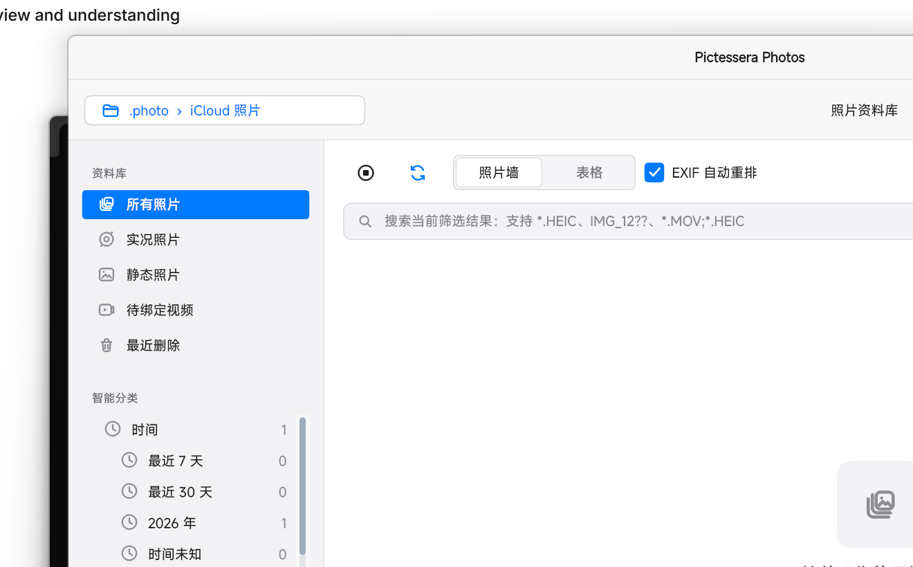
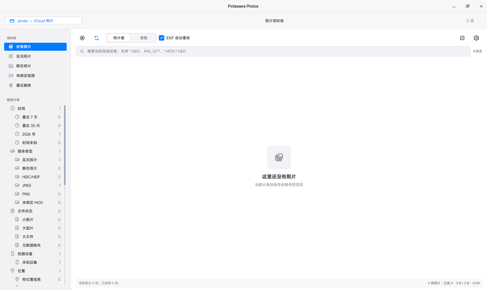

# Pictessera

<p align="center">
  <a href="README.md">English</a> | <strong>简体中文</strong>
</p>

<p align="center">
  
</p>

<p align="center">
  面向 Windows 的本地照片与 Live Photo 管理工具
</p>

Pictessera 用于浏览和整理已经下载到本地的 iCloud 照片。它能够扫描照片目录，将 HEIC/JPEG/PNG 与对应的 MOV 组合为 Live Photo，并提供虚拟化照片墙、表格视图、详情预览、搜索、智能分类和批量文件操作。

照片、EXIF、GPS、分类结果和用户数据默认只在本机处理。Pictessera 不负责登录或同步 iCloud，也不会自动上传照片。



## 主要功能

- 递归扫描本地照片目录，支持随时停止和重新扫描。
- 浏览 HEIC、HEIF、JPEG、JPG 和 PNG 图片。
- 按“同目录、同文件名主体”自动配对图片和 MOV。
- 识别未找到静态图片的 MOV，并支持人工绑定或重新定位。
- 使用虚拟化照片墙和表格处理大型照片库。
- 后台生成缩略图、读取 EXIF/HEIF 元数据并持久化缓存。
- 按拍摄时间排序，元数据缺失时回退到文件修改时间。
- 在非模态详情窗口中缩放、平移、旋转和前后翻页。
- 悬停播放 Live Photo，详情窗口提供快速和高清两阶段预览。
- 支持包含搜索、通配符、AND、OR、排除条件和标签搜索。
- 支持多选、范围选择、全选、右键菜单和选择统计。
- 支持普通导出、移动和 iOS/DCF 风格 `IMG_####` 重排导出。
- 提供应用内垃圾箱、恢复、撤销和重做。
- 提供浅色、深色、Windows 和经典 Mac 风格主题。
- 支持简体中文、繁体中文和英文界面。


## 实况照片预览

Pictessera 会将静态图片与对应 MOV 视为同一个 Live Photo。悬停项目即可触发静音预览；打开详情窗口后，在可用解码器支持下会先快速起播，再补全为更高质量的播放。

<p align="center">
  
</p>
## 智能分类

Pictessera 的分类是虚拟视图，不会为了分类而移动、复制或重命名原始照片。一张照片可以同时属于多个分类，Live Photo 的图片和 MOV 始终作为同一个项目参与分类。

当前规则包括：

| 分类 | 内容 |
| --- | --- |
| 时间 | 年、年月、最近 7 天、最近 30 天、时间未知 |
| 媒体 | Live Photo、静态照片、HEIC/HEIF、JPEG、PNG、未绑定 MOV |
| 来源 | 资料库一级目录、实际来源目录 |
| 设备 | 相机厂商、相机型号、未知设备 |
| 地点 | 有 GPS、无 GPS、粗粒度经纬度区域 |
| 文件 | 小图片、大图片、大文件、元数据缺失 |
| Plus | 事件、连拍、截图、重复、相似、模糊、内容标签、收藏、评分和人工标签 |

分类结果会根据稳定文件标识、文件签名和规则版本增量更新。未变化的项目可以复用已有结果。

## 搜索语法

搜索默认作用于当前分类或当前资料库筛选结果。

```text
IMG_1234              包含搜索
*.HEIC                Explorer 风格通配符
IMG_12??              单字符通配符
*.MOV;*.HEIC          OR 条件，也可以使用 |
旅行 上海             AND 条件
旅行 -截图            排除条件
标签:风景             标签搜索
```

可搜索字段包括文件名、路径、扩展名、媒体类型、拍摄时间、时间来源、事件、内容标签、人工标签、收藏和评分等。

## 系统要求

- Windows 10 或 Windows 11。
- Python 3.9，源码开发环境当前以 Python 3.9.18 验证。
- 推荐使用独立的 Conda 或 `venv` 环境。
- Live Photo 动态预览需要 ffmpeg，或使用包含视频解码依赖的 Plus 版。

### 破晓字体来源

PoxiaoPixel 可从[破晓字型仓库](https://forge.poxiao-labs.work/Fonts/fzg)取得。下载或重新分发字体前，请以该仓库当前的许可与发行说明为准；Pictessera 不内置字体文件。

## 字体与复古主题

系统、浅色、深色、Windows 11 与 Windows 7 主题直接使用 Windows 已安装的界面字体，无需额外安装字体。

Windows 2000 与 Mac OS 8 主题可选用像素字体，以获得更接近原始系统的观感：

- **PoxiaoPixel（破晓 Pixel）** 是两套复古主题的简体、繁体中文推荐字体；其实际家族名为 `PoxiaoPixel`，**小雅 Pixel（XiaoyaPixel）不是替代品**。
- Windows 2000 的英文使用 PoxiaoPixel 的拉丁字形；Mac OS 8 的英文优先使用已获授权的 Chicago 兼容字体，再回退至 PoxiaoPixel。
- 可按 Windows 的通常方式安装字体，也可将合法取得的 `.tt`、`.ttf`、`.otf` 或 `.ttc` 文件放入程序旁的 `Pictessera_Data/fonts/`。从源码运行时，也可放入 `assets/fonts/`。
- 未安装可选字体时，Pictessera 会回退到系统中的中文与界面字体，程序仍可正常使用，但复古视觉不会完全还原。

Chicago、Charcoal、Geneva 等经典系统原版字体及其他专有字体**不会随 Pictessera 分发**。请仅在符合其字体许可的前提下自行取得和使用。
## 从源码运行

克隆或下载项目后，在项目根目录执行：

```powershell
python -m pip install -r requirements.txt
python main.py
```

## 界面预览

默认界面提供侧栏、照片墙 / 表格切换、当前筛选结果搜索和智能分类；现代主题保持克制，信息密度则面向真实的大型照片库。

<p align="center">
  
</p>

<details>
<summary><strong>窗口控制与设置</strong></summary>

可在 Windows 原生控制按钮与 macOS 风格红绿灯之间切换。外观设置会即时应用主题、标题栏样式与强调色，无需重启。

<p align="center">
  
</p>
<p align="center">
  
</p>
</details>

<details>
<summary><strong>经典主题</strong></summary>

Windows 2000 与 Mac OS 8 是可选视觉主题；它们保留同一套照片库功能，但拥有独立的标题栏、控件、配色和可选像素字体规则。

<p align="center">
  
</p>
<p align="center">
  
</p>
</details>

核心依赖：

- PySide6：Windows 桌面界面。
- Pillow：图片读取、缩放和 EXIF 处理。
- pillow-heif：HEIC/HEIF 解码。
- PyInstaller：Windows 单文件打包。

如果 Windows 的 `python` 命令指向 Microsoft Store 占位程序，请直接调用实际环境中的 `python.exe`，或先激活对应 Conda/venv 环境。

## 轻量版与 Plus 版

### 轻量版

轻量版保留照片扫描、HEIC/JPEG/PNG 浏览、元数据、搜索、分类、文件管理和 Live Photo 配对，但不会打包 OpenCV、NumPy、ImageIO、PyTorch 或 Transformers。

```powershell
python -m PyInstaller --clean --noconfirm .\Pictessera.spec
```

输出：

```text
dist/Pictessera.exe
```

如果系统中没有可用的 ffmpeg，静态图片和 Live Photo 文件管理仍可使用，但动态预览可能不可用。

### Plus 版

Plus 版可以包含 ffmpeg、OpenCV、NumPy 和 ImageIO，提供更完整的 iPhone HEVC MOV 解码回退链。开发或打包前按需安装：

```powershell
python -m pip install numpy==1.24.3 opencv-python==4.9.0.80 imageio==2.19.3 imageio-ffmpeg==0.6.0
python -m PyInstaller --clean --noconfirm .\PictesseraPlus.spec
```

输出：

```text
dist/Pictessera-Plus.exe
```

本地 AI 内容识别还可选择安装 `torch`、`transformers` 和 `huggingface-hub`。模型不会由轻量版强制下载或打包。

## 数据与缓存

Pictessera 默认在程序所在目录旁创建 `Pictessera_Data/`，其中可能包含：

```text
Pictessera_Data/
├── settings.json
├── trash_state.json
├── trash_journal.jsonl
├── item_info_cache.json
├── mov_bindings.json
├── auto_categories.json
├── item_category_relations.json
├── photo_manager.db
└── thumbs/
```

主要数据用途：

- `settings.json`：用户设置。
- `item_info_cache.json`：拍摄时间、设备、GPS 和尺寸缓存。
- `mov_bindings.json`：人工 MOV 绑定关系。
- `trash_state.json` / `trash_journal.jsonl`：应用内垃圾箱状态和日志。
- `photo_manager.db`：用户标签、评分、图像特征和大型分类快照。
- `thumbs/`：缩略图缓存。

JSON 状态通常采用临时文件、同步落盘、原子替换和 `.bak` 备份。损坏文件会被隔离，以便从备份恢复或重新生成。

> Pictessera 会执行真实的复制和移动操作。首次管理重要图库前，建议准备独立备份，并先使用少量测试文件熟悉移动、垃圾箱和导出流程。

## 快捷操作

| 操作 | 快捷键或交互 |
| --- | --- |
| 撤销 | `Ctrl+Z` |
| 重做 | `Ctrl+Shift+Z` |
| 详情前后翻页 | `←` / `→`，也可使用 `D` / `A` |
| 下一张或播放 | `Space` |
| 适应详情窗口 | `F` / `Enter` |
| 预览左旋 | `Ctrl+L` |
| 预览右旋 | `Ctrl+R` |
| 关闭详情 | `Esc` |
| 详情缩放 | 鼠标滚轮 |
| 详情平移 | 按住鼠标左键拖动 |

详情中的旋转只影响当前显示，不修改原始照片。

## 项目结构

```text
.
├── main.py                         # 兼容入口和当前主界面
├── photo_manager/
│   ├── bootstrap.py                # Qt/PyInstaller 启动环境
│   ├── config.py                   # 全局策略和默认参数
│   ├── domain/                     # 照片、分类和元数据模型
│   ├── services/                   # 分类、搜索、设置和内容分析
│   ├── infrastructure/             # SQLite、仓储和线程池
│   └── ui/                         # 设置窗口和主题
├── assets/                         # 图标、SVG 和文档截图
├── tests/                          # 快速单元测试
├── Pictessera.spec                 # 轻量版打包配置
└── PictesseraPlus.spec             # Plus 版打包配置
```

项目正在从单文件 Qt 应用迁移到分层架构。新增业务逻辑应优先放入 `domain` 或 `services`，而不是继续扩展 `main.py`。参见 [`ARCHITECTURE.md`](ARCHITECTURE.md)。

## 测试

运行全部测试：

```powershell
python -m unittest discover -s tests -p "test_*.py"
```

当前测试覆盖分类规则、增量缓存、JSON/SQLite 仓储、Plus 特征、搜索、设置、主题和翻译。当前开发环境的结果为：

```text
Ran 46 tests
OK
```

主 GUI、真实 HEIC/MOV 媒体链和文件操作仍需要更多集成与冒烟测试。

## 隐私原则

- 默认仅处理本地文件。
- 不要求 iCloud 账号或网络登录。
- 不自动上传照片、EXIF、GPS 或标签。
- 本地 AI Provider 只读取用户指定的本地模型目录。
- 自动分类不会修改原始照片的目录和文件名。

## 当前限制

- Live Photo 自动配对主要依赖同目录和相同文件名主体，尚未校验 Apple asset identifier。
- 轻量版的动态预览取决于系统 ffmpeg 是否可用。
- 语义向量搜索已有底层实现，但尚未完整接入主界面和批量建库流程。
- 普通移动和部分导出流程仍需加强事务回滚及后台执行。
- 当前主要面向 Windows，未对 macOS 和 Linux 提供正式支持。

## 文档

- [架构说明](ARCHITECTURE.md)
- [打包说明](PACKAGING.md)
- [自动分类需求与系统概览](SYSTEM_OVERVIEW_AND_AUTO_CLASSIFICATION_REQUIREMENTS.txt)
- [自动分类进度](AUTOMATIC_CLASSIFICATION_TODO.md)
- [内容搜索进度](CONTENT_SEARCH_TODO.md)
- [设置系统进度](SETTINGS_TODO.md)

## 参与贡献

欢迎提交 Issue 和 Pull Request。请保持改动聚焦，维护本地优先的隐私原则，并在适用时为业务逻辑补充或更新测试。

## 许可

Pictessera 使用 [MIT License](LICENSE) 开源。
